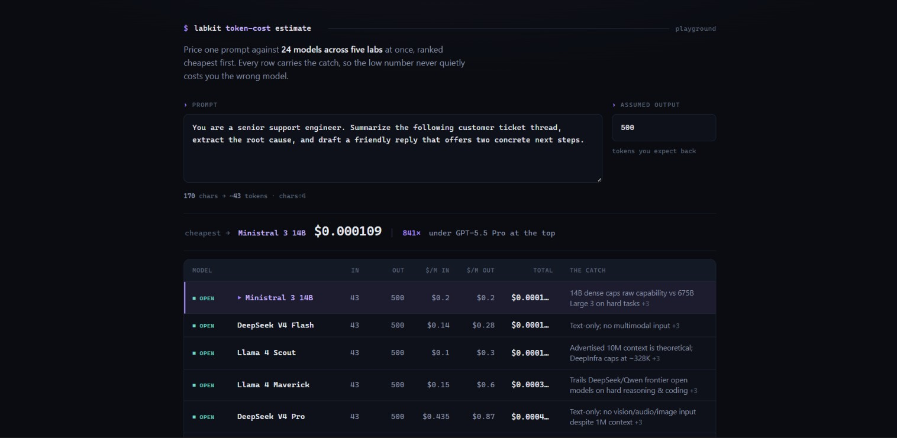

# @labkit/token-cost

**Paste a prompt. See what it costs across 24 models and 5 labs, ranked cheapest first, with each model's known limitations right next to the price.**

Picking a model on price alone is how you end up shipping on something that quietly can't do the job. This tool puts the whole board in front of you in one command: the real token count, the real dollar cost, and the catch.

```text
$ token-cost estimate "Summarize this quarterly earnings report and flag the three biggest risks." --output 400

Input: 74 chars, output assumption: 400 tok

Model                   In tok  Out tok      Total
─────────────────────────────────────────────────────────────
Ministral 3 14B            19*      400   $0.00008  ← cheapest
DeepSeek V4 Flash          19*      400   $0.00011
Llama 4 Scout              19*      400   $0.00012
Gemini 3.1 Flash-Lite      19*      400   $0.00060
Grok 4.3                   19*      400   $0.00102
GLM-5.2                    19*      400   $0.00179
Claude Haiku 4.5           15*      400   $0.00201
GPT-5.6 Luna                14      400   $0.00241
Gemini 3.1 Pro             19*      400   $0.00484
Claude Sonnet 5            15*      400   $0.00605
Claude Opus 4.8            15*      400   $0.01008
Claude Fable 5             15*      400   $0.02015
GPT-5.5 Pro                14      400   $0.07242

Ministral 3 14B is 864x cheaper than GPT-5.5 Pro for this prompt.

Run with --notes to see each model's known limitations.

* estimated count. Set ANTHROPIC_API_KEY / GEMINI_API_KEY for exact counts.
```

*(Trimmed to 13 rows for the README. The real command prints all 24.)*

## Why you'd use it

- **Cheaper isn't the same as better.** `--notes` prints each model's real caveats next to its price, so a 864x cost gap becomes an informed decision instead of a gamble.
- **Real counts, not vibes.** OpenAI counts are exact via the actual tiktoken encoder. Anthropic and Google upgrade to exact via the labs' free counting APIs when you have a key set. Everything else is a clearly-marked estimate.
- **One board, every lab.** OpenAI, Anthropic, Google, xAI, and open-weight models (Llama, DeepSeek, Qwen, GLM, Mistral) side by side. No tab-switching across five pricing pages.

## Install

```bash
npm i -g @labkit/token-cost   # once published
token-cost estimate "your prompt"
```

Or run it straight from the repo:

```bash
pnpm install && pnpm build
node packages/token-cost/dist/cli.js estimate "your prompt"
```

## Use it

```bash
# price a prompt, assume a 300-token answer
token-cost estimate "Summarize this quarterly report" --output 300

# see the catch, not just the cost
token-cost estimate "Refactor this service into three modules" --output 800 --notes

# from a file, or piped in
token-cost estimate --file prompt.txt --output 500
cat prompt.txt | token-cost estimate --output 500

# machine-readable, for scripts and dashboards
token-cost estimate "your prompt" --json
```

`--notes` is the one worth remembering. It turns "which is cheapest" into "which is cheapest *that I can actually ship on*":

```text
Known limitations (weigh before picking on price alone):
  GLM-5.2
    - Trails Claude Opus 4.8 on SWE-bench Pro (62.1 vs 69.2) for hard coding
    - Reasoning verbosity inflates output tokens and latency on agent loops
  Grok 4.3
    - Reasoning by default: hidden thinking inflates billed output tokens
    - Vision is input-only; no native image or audio generation
```

## Exact vs estimated

A `*` next to a token count means it's an estimate. Here's what's what:

| Lab | Count |
| --- | --- |
| OpenAI | Exact, offline, via `js-tiktoken`. |
| Anthropic | Estimate by default. Set `ANTHROPIC_API_KEY` to upgrade to exact via the free count-tokens API. |
| Google | Estimate by default. Set `GEMINI_API_KEY` to upgrade to exact via the free countTokens API. |
| xAI, open-weight | Estimate (chars/4). These labs ship no public offline tokenizer. |

Those counting APIs are free (they never bill tokens), and if one is unreachable the command falls back to the estimate rather than failing. It never blocks on a missing key.

## In your own code

```ts
import { compare, resolveTokenizers } from "@labkit/token-cost";

// offline: exact OpenAI, honest estimates elsewhere
const results = compare("summarize this document", { outputTokens: 500 });
// -> CostEstimate[] sorted cheapest first, each with:
//    { model, inputTokens, outputTokens, inputCost, outputCost, totalCost, exact }

// with keys set: upgrade Anthropic + Google to exact counts
const tokenizers = await resolveTokenizers("summarize this document", {
  anthropicApiKey: process.env.ANTHROPIC_API_KEY,
  geminiApiKey: process.env.GEMINI_API_KEY,
});
const exact = compare("summarize this document", { outputTokens: 500, tokenizers });
```

Each result carries the model's `limitations` too, so you can surface the caveats in your own UI.

## Playground

Open [`playground/index.html`](./playground/index.html) in any browser for a zero-install, type-as-you-go version of the same comparison. No build, no keys, no network.



---

Prices are USD per 1M tokens, standard tier, verified in `@labkit/core`'s registry. Some models charge a higher rate above a token threshold (Gemini 3.1 Pro jumps to $4/$18 above 200k input tokens); the tool applies that automatically.
